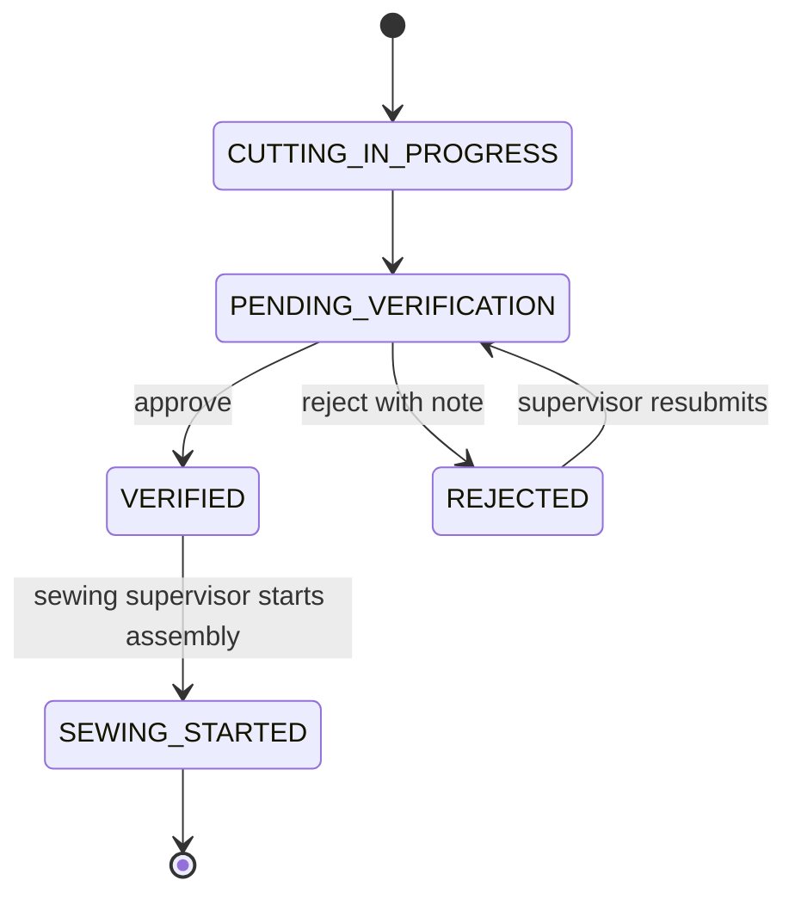
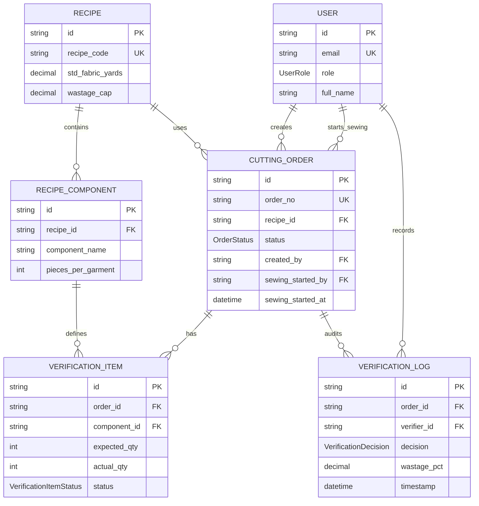

# ApparelFlow ERP

## Overview

ApparelFlow is a cutting-to-sewing gatekeeper for garment production batches. Cutting supervisors create and submit orders, cutting verifiers count components and approve or reject batches, and sewing supervisors can read only verified batches and start assembly.

## Live URL And Demo Credentials

The deployed application is available at [https://apparelflow-erp-eosin.vercel.app/](https://apparelflow-erp-eosin.vercel.app/). Local development runs at `http://localhost:3000`.

All seeded demo users use the password `Demo@12345`.

| Role | Email | Password | Can do |
| --- | --- | --- | --- |
| Cutting supervisor | `supervisor@apparelflow.test` | `Demo@12345` | Create cutting orders, submit or resubmit orders, and view cutting-order status. |
| Cutting verifier | `verifier@apparelflow.test` | `Demo@12345` | View pending verification orders, save component counts, approve valid batches, or reject with a note. |
| Sewing supervisor | `sewing@apparelflow.test` | `Demo@12345` | View verified sewing queue entries, inspect approved verification details, and start sewing assembly. |

## Tech Stack

| Technology | Why it is used |
| --- | --- |
| Next.js 16 App Router | Server-rendered route boundaries, API route handlers, and the role-gated application shell. |
| React 19 | Client interactions for the supervisor, verifier, and sewing work surfaces. |
| TypeScript | Strictly typed request, service, database, and UI contracts. |
| Tailwind CSS 4 | Focused, responsive UI styling with existing utility classes. |
| Prisma 6 | Typed PostgreSQL access and transaction boundaries. |
| PostgreSQL via Supabase | Persistent production-style relational storage. |
| Zod | Strict request validation, including rejection of unexpected fields. |
| `jose` and `bcryptjs` | JWT session signing/verification and password verification. |
| Vitest | Unit, validation, and database-backed integration tests. |

## Architecture

### Folder Structure

```text
src/app/                 App Router pages and API route handlers
src/app/api/             Auth, cutting-order, verification, and sewing endpoints
src/app/components/     Shared session-aware header and logout control
src/app/*/layout.tsx     Server-side role gates for each role page
src/lib/                 Auth, RBAC, state machine, validation, calculations
src/lib/services/        Order and verification/sewing business logic
prisma/                  Schema, seed script, and ordered migrations
tests/                   Unit, validation, and integration tests
scripts/                 Security smoke checks
```

Business rules live in `src/lib/services/`, not in page components or route handlers. The normal request path is:

```text
route handler -> requireRole -> Zod validation -> service -> Prisma transaction
```

Page role isolation is enforced separately by the server layouts for `/supervisor`, `/verifier`, and `/sewing`. The shared header reads the JWT session and database user profile, then shows only the current role's navigation.

## State Machine



| From | Allowed transition | Operation |
| --- | --- | --- |
| `CUTTING_IN_PROGRESS` | `PENDING_VERIFICATION` | Supervisor submits order. |
| `PENDING_VERIFICATION` | `VERIFIED` | Verifier approves only when every item is countable and non-RED. |
| `PENDING_VERIFICATION` | `REJECTED` | Verifier rejects with a required note. |
| `REJECTED` | `PENDING_VERIFICATION` | Supervisor resubmits; saved counts and item statuses reset. |
| `VERIFIED` | `SEWING_STARTED` | Sewing supervisor starts assembly atomically. |
| `SEWING_STARTED` | None | Terminal state in the current workflow. |

## API Reference

All protected endpoints use the `af_session` HTTP-only JWT cookie. `401` means no valid session; `403` means the session role is not allowed. Other codes are returned only where the route/service supports that condition.

| Method | Path | Allowed role | Success | Error codes |
| --- | --- | --- | --- | --- |
| `POST` | `/api/auth/login` | Public | `200` | `400`, `401` |
| `POST` | `/api/auth/logout` | Public | `200` | None |
| `GET` | `/api/orders` | `cutting_supervisor` | `200` | `401`, `403` |
| `POST` | `/api/orders` | `cutting_supervisor` | `201` | `401`, `403`, `404`, `422`, `500` |
| `POST` | `/api/orders/:id/submit` | `cutting_supervisor` | `200` | `400`, `401`, `403`, `404`, `409`, `500` |
| `GET` | `/api/recipes` | `cutting_supervisor` | `200` | `401`, `403` |
| `GET` | `/api/verify/orders` | `cutting_verifier` | `200` | `401`, `403` |
| `GET` | `/api/verify/:id` | `cutting_verifier` | `200` | `400`, `401`, `403`, `404` |
| `POST` | `/api/verify/:id/counts` | `cutting_verifier` | `200` | `400`, `401`, `403`, `404`, `409`, `422`, `500` |
| `POST` | `/api/verify/:id/approve` | `cutting_verifier` | `200` | `400`, `401`, `403`, `404`, `409`, `422`, `500` |
| `POST` | `/api/verify/:id/reject` | `cutting_verifier` | `200` | `400`, `401`, `403`, `404`, `409`, `422`, `500` |
| `GET` | `/api/sewing/queue` | `sewing_supervisor` | `200` | `401`, `403` |
| `GET` | `/api/sewing/:id` | `sewing_supervisor` | `200` | `401`, `403`, `404` |
| `POST` | `/api/sewing/:id/start` | `sewing_supervisor` | `200` | `401`, `403`, `404`, `409`, `422` |

The sewing queue ignores query parameters and always queries `status = VERIFIED`. Sewing detail returns `404` for orders that are not `VERIFIED` or `SEWING_STARTED` so order existence is not leaked.

## Database Schema

| Table | Key columns and relations |
| --- | --- |
| `users` | `id`, `email`, `role`, `full_name`; owns cutting orders, sewing-start records, and verification logs. |
| `recipes` | Recipe identity, standard fabric yards, wastage cap; has recipe components and cutting orders. |
| `recipe_components` | Component name, pieces per garment, optional image; belongs to a recipe. |
| `cutting_orders` | Order number, recipe, target quantity, fabric usage, status, creator, optional sewing starter/timestamp. |
| `verification_items` | Expected/actual component quantities and traffic-light status; belongs to an order and component. |
| `verification_logs` | Immutable approval/rejection decision, verifier, note, wastage, variance JSON, and server timestamp. |



The migration `20261008132500_immutable_verification_logs` installs a database trigger that rejects `UPDATE` and `DELETE` on `verification_logs`. The migration `20261008182832_enable_rls_on_application_tables` enables Row Level Security on all six application tables with no policies. Prisma connects using the PostgreSQL role, which bypasses RLS; anonymous/authenticated Supabase API keys do not.

## Security Model

- RBAC is enforced server-side with `requireRole`; client visibility is only UX isolation.
- Approval is a hard stop: RED or uncounted verification items produce `422` and cannot transition to `VERIFIED`.
- Sewing queue queries hardcode `VERIFIED`, and sewing detail queries admit only `VERIFIED` or `SEWING_STARTED`.
- User IDs and roles come from the verified JWT session, never request payloads. Timestamps come from the server/database path.
- Zod schemas are strict. Approval accepts an empty object only; rejection requires a note; unexpected fields are rejected.
- Status changes and audit-log writes occur inside Prisma transactions with atomic status predicates and row locking where required.
- Role page layouts read the session cookie on the server and redirect mismatched roles to their own home page.

## Running Locally

1. Install dependencies:

   ```bash
   npm install
   ```

2. Copy `.env.example` to `.env` and set:

   - `DATABASE_URL`: pooled PostgreSQL/Supabase URL for Prisma Client.
   - `DIRECT_URL`: direct PostgreSQL/Supabase URL for migrations.
   - `JWT_SECRET`: long random signing secret.

3. Apply migrations:

   ```bash
   npx prisma migrate dev
   ```

4. Seed the demo users and recipe:

   ```bash
   npx tsx prisma/seed.ts
   ```

5. Start the development server:

   ```bash
   npm run dev
   ```

## Testing

Run the complete Vitest suite:

```bash
npm test
```

Test coverage is organized as follows:

| File | Covers |
| --- | --- |
| `tests/multiplier.test.ts` | Expected component and fabric calculations. |
| `tests/trafficLight.test.ts` | GREEN/YELLOW/RED traffic-light classification. |
| `tests/gatekeeper.test.ts` | Approval eligibility for counted, RED, and uncounted items. |
| `tests/wastage.test.ts` | Fabric wastage calculations. |
| `tests/stateMachine.test.ts` | Allowed and rejected order transitions. |
| `tests/validation/order.test.ts` | Strict cutting-order request validation. |
| `tests/validation/verification.test.ts` | Strict counts, approval, and rejection validation. |
| `tests/integration/validation/order.test.ts` | Order validation integration behavior. |
| `tests/integration/validation/verification.test.ts` | Verification validation integration behavior. |
| `tests/verification.test.ts` | Database-backed approval, rejection, RBAC, audit, and immutability behavior. |
| `tests/sewing.test.ts` | Sewing queue isolation, detail hiding, RBAC, and atomic sewing start behavior. |

The database-backed suites require a reachable configured PostgreSQL database with migrations applied. They use `DATABASE_URL` from the current environment and may take longer when using a remote Supabase pool. Use a separate test database for a fresh-clone run when possible.

The security smoke script requires Bash, `curl`, and `jq`:

```bash
bash scripts/security-smoke.sh http://localhost:3000
```

It logs in each demo role, creates its own API orders, and prints PASS/FAIL results for the cross-role and validation expectations.

## Assumptions And Known Limitations

- Deployment configuration and Vercel project metadata are external to the codebase.
- The root page is a minimal foundation screen; role users reach their work surface through the role-specific paths after authentication.
- The current workflow has no sewing completion or downstream production stages after `SEWING_STARTED`.
- The security smoke script is Bash-based and is not executable in a plain Windows PowerShell session without Git Bash, WSL, or CI.
- Demo credentials are intentionally included for assessment/development use only and must not be used in production.
- RLS is enabled without policies by design. Application access must use the configured Prisma PostgreSQL connection; direct anonymous/authenticated Supabase API access is intentionally denied.
